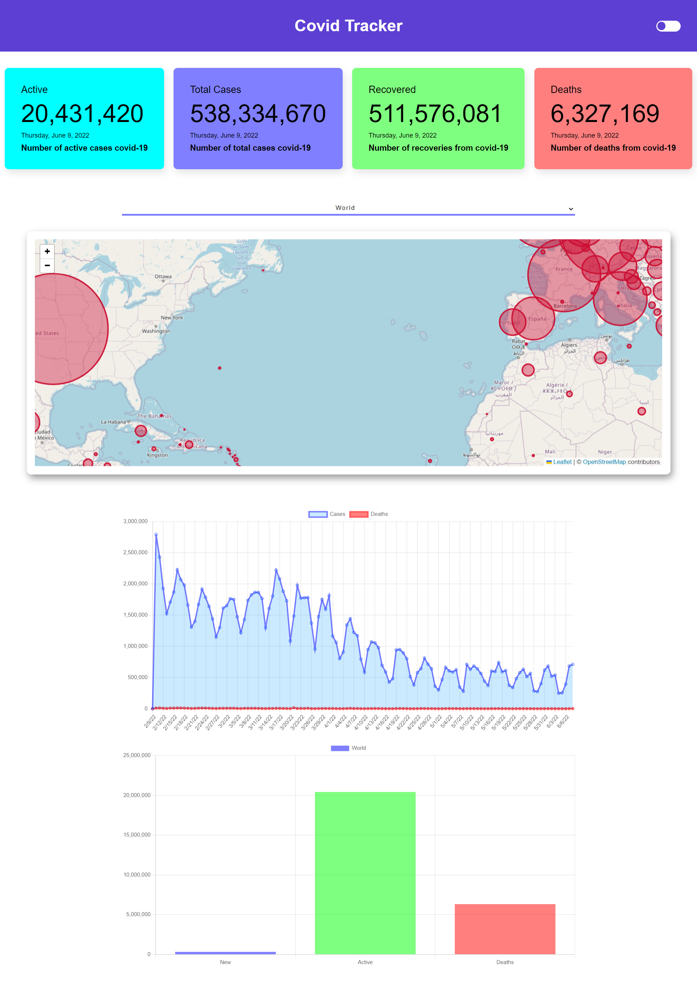

# Covid Tracker

This project is a covid tracker which tracks covid cases all around the world and for different countries. Here's the [live site](https://sourabh358.github.io/Covid-Tracker/)
## About project

It represents data in the form of a line chart and a bar chart. Line chart shows the covid cases for past 120 days in a country as selected by the user. Whereas the bar chart represents the total covid cases for the country, total deaths by the covid, and total recovered people from covid. Site also have a toggle for light and dark mode. Site is full responsive. Chart are used to convey data more beautifully.

## Tools Used

The project is made in react using create react app, with the use of APIS and other js modules here is a description of all the tools used in making of this project.  
- create-react-app
- Chart.js
- react countUp
- axios
- [Diseases.sh](https://disease.sh/)
- gh-pages

## Screenshot

**To be continued...**  
**Author**  
Sourabh Yadav - [@sourabh358](https://github.com/SOURABH358)❤
